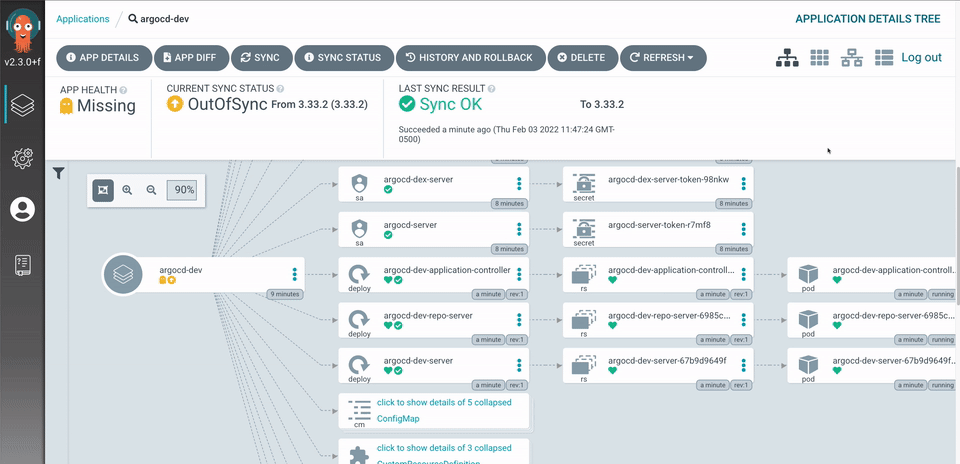

# CI/CD concept 

The (C)ontinous (I)integration/(C)ountinous (D)eployment concept 
to host and maintain domain ligidi.africa ([link](https://ligidi.africa)).


## Domain 'ligidi.africa'

### Reverse proxy dashboard - https://ligidi.africa/dasboard/#

* user: admin
* password: **** (hint: equal username)

The Traefik dashboard is the place that shows the current 
active routes, services and middlewares handled by Traefik.

### Sample service whoami - https://ligidi.africa/whoami/test

Sample service installation maintained by argocd.

```
curl -L https://ligidi.africa/whoami/test
```

## Sub-domain 'argocd.ligidi.africa'

(C)ontinous (D)eployment installation Argo-CD([link](https://argo-cd.readthedocs.io/en/stable/))
to maintain the `ligidi.africa` services as applications.

* link: https://argocd.ligidi.africa
* user: admin
* password: **** (hint: equal username)



## Sub-domain 'docker.ligidi.africa'

Self-hosted docker registry to share service images to run them in the cluster.

* user: admin
* password: **** (hint: equal username)

```
docker login docker.ligidi.africa
docker pull docker.ligidi.africa/whoami:latest
docker push ...
```

## Sub-domain 'helm.ligidi.africa'

> GET https://helm.ligidi.africa/charts # has no access permission 

Write/push user: 
* user: admin
* password: **** (hint: equal username)

> Not supported: `helm repo add`  

## Contributing

1. Enhance `ligidi.africa` cluster setup ([link](./infrastructure))
2. Enhance `argocd.ligidi.africa` argocd applications ([link](./infrastructure/argocd))    
3. Enhance `helm.ligidi.africa` helmcharts ([link](./helmcharts))
4. Enhance sample service ([link](./service))

The 3 subdirectories `./infrastructure`, `./helmcharts` and `./service` 
should be 3 separate repositories. For the concept it's sufficient
that the directories represent this repository.

## CI/CD process

