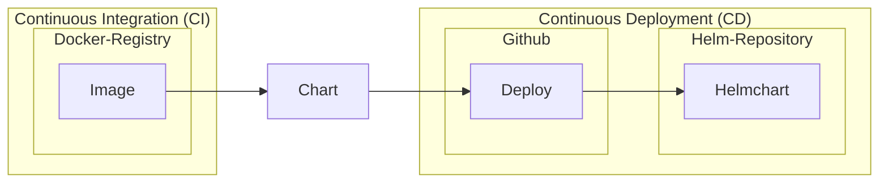

# Helm charts

* [spring-boot-app](./spring-boot-app)
* [whoami](./whoami)

## Deploying the helm charts

1. After the new Image build and pushed to the Docker Registry
2. Update the helmchart if necessary 
3. Deploy the helmchart to Helm Repository

ArgoCD continuously pull the changes of the helmcharts 
to sync the applications into the cluster when chart 
version ranges are configured. 

## Helm chart: spring-boot

The spring-boot helm chart is a general chart that deploys a 
spring boot service. The chart is a simple example of how to deploy a spring boot service using helm.

* github-action: [build-helmchart-spring-boot-app](https://github.com/treboulit/kubernetes-environment-concept/blob/main/.github/workflows/build-helmchart-spring-boot-app.yaml)
* git-tag: `csX.Y.Z` (e.g. [cs1.0.0](https://github.com/treboulit/kubernetes-environment-concept/tree/cs1.0.0))

## Helm chart: whoami

The whoami helm chart is a simple helm chart that deploys a 
whoami service. The chart is a simple example of how to deploy a whoami service using helm.

* github-action: [build-helmchart-whoami](https://github.com/treboulit/kubernetes-environment-concept/blob/main/.github/workflows/build-helmchart-whoami.yaml)
* git-tag: `cwX.Y.Z` (e.g. [cw1.0.0](https://github.com/treboulit/kubernetes-environment-concept/tree/cw1.0.0))