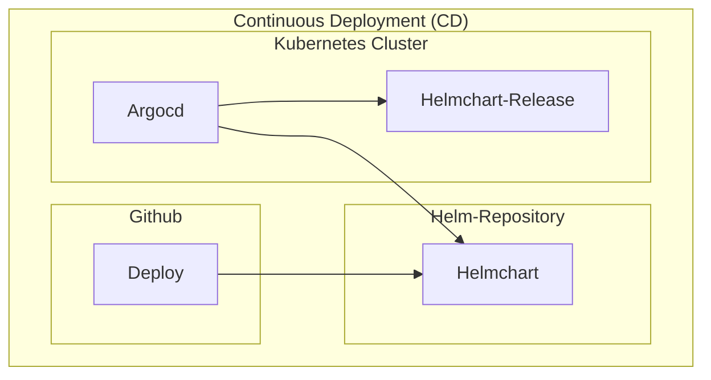

# Infrastructure

## ArgoCD 'argocd' application

Continuous Deployment (CD) of the helm charts to the 'k3s-cluster' using ArgoCD.

* [argocd/apps](./argocd/apps) - All ArgoCD applications
* [argocd/traefik](./argocd/traefik) - Traefik Helm Chart configuration
* [argocd/dokcer-registry](./argocd/registry) - Reverse Proxy route to the Docker Registry ([https://docker.ligidi.africa](https://docker.ligidi.africa))
* [argocd/helm-repository](./argocd/helm-repository) - Reverse Proxy route to the Helm Repository ([https://helm.ligidi.africa](https://helm.ligidi.africa))
* [argocd/*](./argocd/) - All other referenced ArgoCD application helm charts

Any ArgoCD application folder contains subfolder named by domains where they can be deployed.

* `ligidi.africa` - The main domain
* `localhost` - Local development

ArgoCD continuously pull the changes of the helmcharts 
to sync the ArgoCD applications([infrastructure/argocd/app](./argocd/app)) into the cluster. 

## Cluster 'cluster' setup

1. Setup 'k3s-cluster' as docker container
2. Setup 'docker-registry' as docker container
3. Setup 'helm-repository' as docker container

## Debian 'host' setup

Initial setup of the debian host to run the cluster and the docker containers.

## ArgoCD applications

### 1) Docker Registry

Reverse proxy route configuration to provide access to the docker registry.

* URL: https://docker.ligidi.africa - The docker registry
* App: [./apps/ligidi.africa/templates/docker-registry-application.yaml](./apps/ligidi.africa/templates/docker-registry-application.yaml)
* Resources: [./docker-registry/docker.ligidi.africa](./docker-registry/docker.ligidi.africa)

### 2) Helm Repository

Reverse proxy route configuration to provide access to the helm repository.

* URL: https://helm.ligidi.africa - The helm repository
* App: [./apps/ligidi.africa/templates/helm-repository-application.yaml](./apps/ligidi.africa/templates/docker-registry-application.yaml)
* Resources: [./helm-repository/docker.ligidi.africa](./helm-repository/docker.ligidi.africa)
* Sources: [charts](../helmcharts)

### 3) Traefik 

* URL: https://ligidi.africa/dashboard/# - The traefik dashboard
* App: [./apps/ligidi.africa/templates/traefik-application.yaml](./apps/ligidi.africa/templates/traefik-application.yaml)
* Resources: [./traefik/ligidi.africa](./traefik/ligidi.africa)

### 4) Monitoring

* URL: https://ligidi.africa/grafana - The grafana dashboard
* App: [./apps/ligidi.africa/templates/monitoring-application.yaml](./apps/ligidi.africa/templates/monitoring-application.yaml)
* Resources: [./monitoring/ligidi.africa](./monitoring/ligidi.africa)
* Helmchart: kube-prometheus-stack at [github](https://github.com/prometheus-community/helm-charts/tree/main/charts/kube-prometheus-stack)

### 5) Monitoring Loki

* URL: https://ligidi.africa/grafana - The grafana dashboard
* App: [./apps/ligidi.africa/templates/monitoring-loki-application.yaml](./apps/ligidi.africa/templates/monitoring-loki-application.yaml)
* Resources: [./monitoring-loki/ligidi.africa](./monitoring-loki/ligidi.africa)
* Helmchart: loki-stack at [github](https://github.com/grafana/helm-charts/tree/main/charts/loki)
* Doc: https://grafana.com/docs/loki/latest/setup/install/helm/install-monolithic/ 

### 6) Sample - Spring Boot Application

* URL: https://ligidi.africa/api/spring-sample - The sample spring boot application
* App: [./apps/ligidi.africa/templates/spring-boot-app-application.yaml](./apps/ligidi.africa/templates/spring-boot-app-application.yaml)
* Resources: [./spring-boot-app](./spring-boot-app)
* * Sources: [chart](../helmcharts/spring-boot-app)

### 7) Sample - Whoami Application

* URL: https://ligidi.africa/whoami/test - The sample whoami application
* App: [./apps/ligidi.africa/templates/whoami-application.yaml](./apps/ligidi.africa/templates/whoami-application.yaml)
* Resources: [./whoami](./whoami)
* Sources: [chart](../helmcharts/whoami)