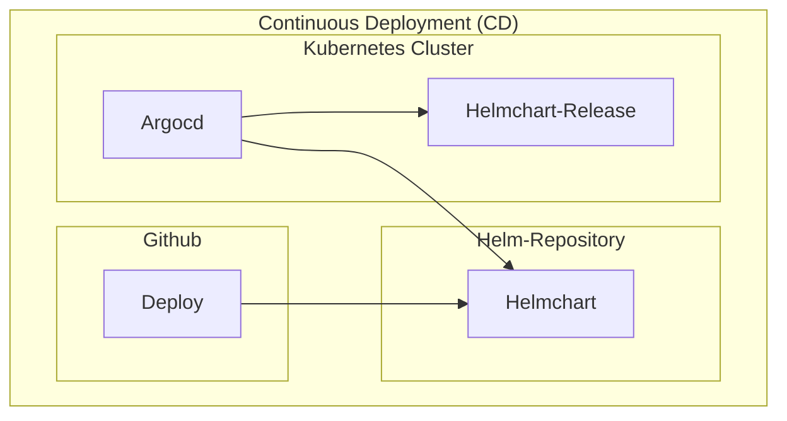

# Infrastructure

## ArgoCD 'argocd' application

Continuous Deployment (CD) of the helm charts to the 'k3s-cluster' using ArgoCD.

ArgoCD continuously pull the changes of the helmcharts 
to sync the ArgoCD applications([infrastructure/argocd/app](./argocd/app)) into the cluster. 

## Cluster 'cluster' setup

1. Setup 'k3s-cluster' as docker container
2. Setup 'docker-registry' as docker container
3. Setup 'helm-repository' as docker container

## Debian 'host' setup

Initial setup of the debian host to run the cluster and the docker containers.