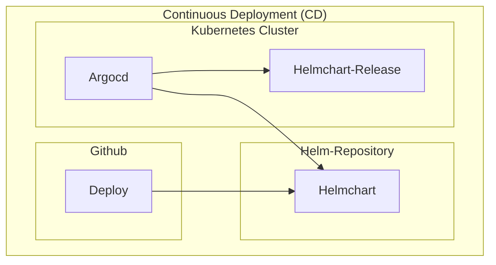

# Infrastructure

## ArgoCD 'argocd' application

Continuous Deployment (CD) of the helm charts to the 'k3s-cluster' using ArgoCD.

* [argocd/apps](./argocd/apps) - All ArgoCD applications
* [argocd/traefik](./argocd/traefik) - Traefik Helm Chart configuration
* [argocd/dokcer-registry](./argocd/registry) - Reverse Proxy route to the Docker Registry ([https://docker.ligidi.africa](https://docker.ligidi.africa))
* [argocd/helm-repository](./argocd/helm-repository) - Reverse Proxy route to the Helm Repository ([https://helm.ligidi.africa](https://helm.ligidi.africa))
* [argocd/*](./argocd/) - All other referenced ArgoCD application helm charts

Any ArgoCD application folder contains subfolder named by domains where they can be deployed.

* `ligidi.africa` - The main domain
* `localhost` - Local development

ArgoCD continuously pull the changes of the helmcharts 
to sync the ArgoCD applications([infrastructure/argocd/app](./argocd/app)) into the cluster. 

## Cluster 'cluster' setup

1. Setup 'k3s-cluster' as docker container
2. Setup 'docker-registry' as docker container
3. Setup 'helm-repository' as docker container

## Debian 'host' setup

Initial setup of the debian host to run the cluster and the docker containers.